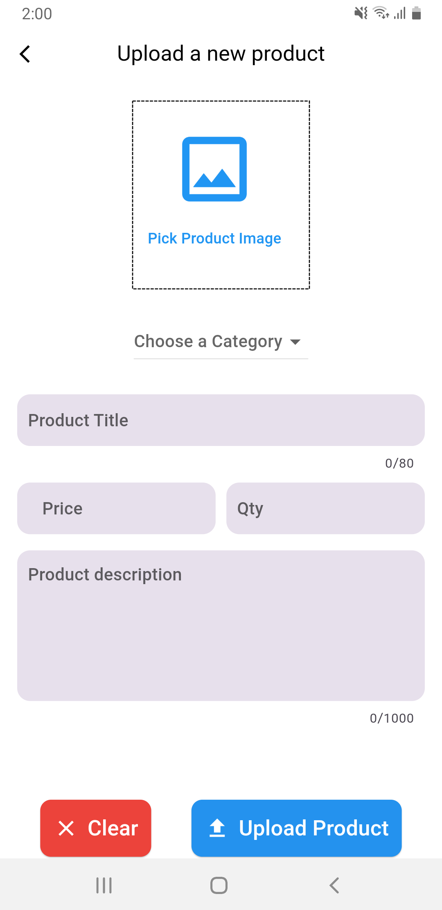
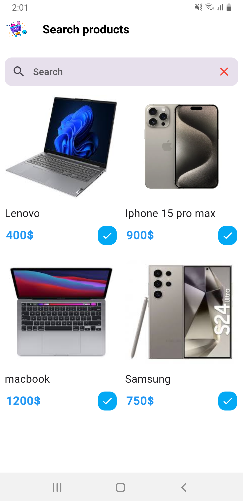

# admin_panel

  

  

  

Packages used in this application :

https://pub.dev/packages/dotted_border

https://pub.dev/packages/shared_preferences

https://pub.dev/packages/provider

https://pub.dev/packages/iconly

https://pub.dev/packages/fancy_shimmer_image

https://pub.dev/packages/dynamic_height_grid_view

https://pub.dev/packages/uuid

https://pub.dev/packages/image_picker

